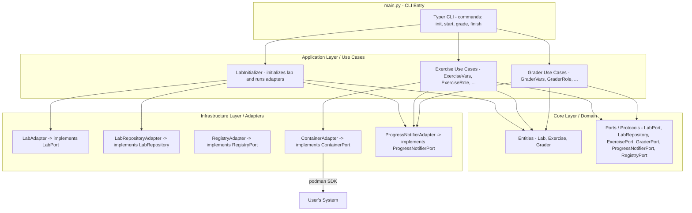

# Lab - CLI Framework — Technical Documentation

CLI management tool for the Ansible101 course. Allows students to initialize their environment, start exercises, grade them and clean up — all with a single Python package.

**License:** GPLv3 · **Python:** `>=3.10`

🌐 [Español](README.md) | **English**

---

## Index

1. [Architecture](#architecture)
2. [File Structure](#file-structure)
3. [Lab Entity and Persisted State](#lab-entity-and-persisted-state)
4. [CLI Commands](#cli-commands)
5. [Detailed `lab init` Flow](#detailed-lab-init-flow)
6. [Dynamic Exercise and Grader Registry](#dynamic-exercise-and-grader-registry)
7. [Adding a New Exercise](#adding-a-new-exercise)
8. [Internationalization (i18n)](#internationalization-i18n)
9. [Progress Notifier (Spinners)](#progress-notifier-spinners)
10. [Runtime Dependencies](#runtime-dependencies)
11. [Local Development](#local-development)
12. [Distribution (Wheel)](#distribution-wheel)

---

## Architecture

The project follows **Hexagonal Architecture (Ports & Adapters)**, split into four layers that must never be bypassed:

```
┌─────────────────────────────────────────────────┐
│  main.py  (CLI Entry — Typer)                   │  ← Entry layer
└────────────────────┬────────────────────────────┘
                     │ invokes
┌────────────────────▼────────────────────────────┐
│  Application Layer  (Use Cases)                 │  ← Orchestration
│  LabInitializer, Exercise*, Grader*             │
└──────┬──────────────────────────┬───────────────┘
       │ uses Ports (interfaces)  │ uses Ports
┌──────▼──────────┐   ┌──────────▼───────────────┐
│  Core / Domain  │   │  Infrastructure / Adapters│  ← Concrete implementations
│  Entities, DTOs │   │  LabAdapter, ContainerAd. │
│  Interfaces     │   │  RegistryAdapter, i18n... │
└─────────────────┘   └──────────────────────────┘
```

### Key Rule
> **Upper layers only depend on interfaces (ports), never on concrete implementations.** Implementations are injected from `main.py` or from the corresponding Use Case.



---

## File Structure

```
cliapp/
├── pyproject.toml              # Package metadata and build-system
├── build_requirements.txt      # Only: build  (for python -m build)
├── README.md                   # Spanish docs
├── README.en.md                # This file
├── LICENSE
└── lab/
    ├── main.py                      # Typer entry point
    ├── application/
    │   └── use_cases/
    │       ├── lab_initializer.py       # Orchestrates `lab init`
    │       ├── exercise/
    │       │   ├── __init__.py          # Registry EXERCISES = {name: Class}
    │       │   ├── exercise_vars.py
    │       │   ├── exercise_role.py
    │       │   ├── exercise_webservers.py
    │       │   ├── exercise_databases.py
    │       │   ├── exercise_final.py
    │       │   └── template.py          # Template for new exercises
    │       └── grader/
    │           ├── __init__.py          # Registry GRADERS = {name: Class}
    │           ├── grader_vars.py
    │           ├── grader_role.py
    │           ├── grader_webservers.py
    │           └── grader_databases.py
    ├── core/
    │   ├── entities/
    │   │   └── lab.py                   # Lab entity (global state)
    │   ├── dtos/
    │   │   └── EventInfo.py             # DTO for spinner / event result
    │   └── interfaces/                  # Ports (ABCs / Protocols)
    │       ├── lab_port.py
    │       ├── lab_repository.py
    │       ├── container_port.py
    │       ├── exercise_port.py
    │       ├── grader_port.py
    │       ├── progress_notifier_port.py
    │       └── registry_port.py
    └── infrastructure/
        ├── adapters/
        │   ├── lab_adapter.py              # verify_context + init (builds images)
        │   ├── lab_repository_adapter.py   # load/save .lab_config.json
        │   ├── container_adapter.py        # Podman SDK wrapper
        │   └── registry_adapter.py         # Auto-discovery of exercises, graders and images
        ├── containerfiles/
        │   └── podman-ssh-ol8.Containerfile   # Lab base image (OL8 + SSH)
        └── ui/
            ├── i18n.py                        # es/en dictionaries + get_text()
            ├── progress_notifier_adapter.py   # Spinners via Rich
            └── console_utils.py               # Console helpers
```

---

## Lab Entity and Persisted State

The `Lab` entity (`lab/core/entities/lab.py`) represents the global lab state. It has two validated fields via `@property`:

| Field | Valid values | Default |
|---|---|---|
| `engine` | `"podman"` | `"podman"` |
| `language` | `"es"`, `"en"` | `"es"` |

State is persisted to **`.lab_config.json`** in the student's working directory via `LabRepositoryAdapter`:

```json
{"engine": "podman", "language": "en"}
```

> `save()` uses `@property` introspection to automatically serialize all `Lab` fields. Adding a new `@property` field will be persisted without touching the adapter.

---

## CLI Commands

```
lab [OPTIONS] COMMAND [ARGS]...

Commands:
  init      Initialize the lab (build images + deploy SSH key)
  start     Start exercise dependencies (containers, config...)
  grade     Grade the specified exercise against defined criteria
  finish    Release exercise dependencies (remove containers, etc.)

Options:
  --version / -version
  -h, --help
```

The `start`, `grade` and `finish` commands accept `--debug / -d` to enable `DEBUG` level logging.

### Dynamic Autocompletion

`start` and `grade` have dynamic autocompletion via `RegistryAdapter`:

```python
def exercises_autocomplete(ctx, args, incomplete):
    registry = RegistryAdapter()
    return [name for name in registry.auto_discover_exercises() if name.startswith(incomplete)]
```

---

## Detailed `lab init` Flow

```
user: lab init [podman] [--debug]
              │
              ▼
         main.py::init()
              │  prompt language (es/en)
              │  Lab(engine=engine, language=language)
              ▼
         LabInitializer.execute(LabAdapter, LabRepositoryAdapter, Lab)
              │
              ├─ 1. repo_adapter.save(lab)
              │       → writes .lab_config.json  ← ALWAYS FIRST
              │
              ├─ 2. service.verify_context()
              │       → shutil.which("ansible")  ← Ansible must be in PATH
              │       ✗ → sys.exit(1) with error message
              │
              ├─ 3. service.init(ContainerAdapter, LAB_IMAGES)
              │       → RegistryAdapter.auto_discover_images()  (reads embedded Containerfiles)
              │       → ContainerAdapter.init_client()          (connects to Podman daemon)
              │       → ContainerAdapter.build_image(image)     (for each Containerfile)
              │       ✗ → sys.exit(1) with error message
              │
              └─ 4. self._deploy_priv_key()
                      → writes ~/.ssh/id_lab (private key, chmod 600)
                      → allows Ansible to access containers without a password
```

> **Why does `save()` go before `verify_context()`?**
> To ensure the chosen language is persisted even if the Ansible check fails (e.g. in a dev environment without Ansible installed). If the order were reversed, the user would have to re-select their language on the next attempt.

---

## Dynamic Exercise and Grader Registry

The system uses a **registry dictionary** defined in the `__init__.py` of each subpackage. No external config — pure Python:

```python
# exercise/__init__.py
EXERCISES = {
    "vars":       ExerciseVars,
    "role":       ExerciseRole,
    "webservers": ExerciseWebServers,
    "databases":  ExerciseDatabases,
    "final":      ExerciseFinal,
}
```

`RegistryAdapter` simply exposes it:

```python
def auto_discover_exercises(self):
    return EXERCISES   # dict {name: Class}
```

`main.py` resolves the exercise name, instantiates the class and calls the method:

```python
cls = exercises_map.get(exercisename.lower())
exercise = cls(exercisename)
exercise.start(notifier)     # or .grade() / .finish()
```

`Containerfile`s are discovered via `importlib.resources`, ensuring they work both with `pip install -e .` and when installed from the `.whl`.

---

## Adding a New Exercise

1. **Create** `lab/application/use_cases/exercise/exercise_new.py` based on `template.py`:
   - Class with `start(notifier)` and `finish(notifier)` methods.
   - Each step: `EventInfo` → `notifier.start()` → operation → `notifier.finish()`.
   - All text strings via `get_text(LANG, 'key')`.

2. **Register** in `exercise/__init__.py`:
   ```python
   from .exercise_new import ExerciseNew
   EXERCISES = { ..., "new": ExerciseNew }
   ```

3. **Create grader** `grader/grader_new.py` with a `grade(notifier)` method and register it in `grader/__init__.py`.

4. **Add strings** to `lab/infrastructure/ui/i18n.py` for both `"es"` and `"en"` blocks.

> No need to touch `main.py` or `RegistryAdapter`. The new exercise will appear automatically in `lab start`, `lab grade` and `lab finish`.

---

## Internationalization (i18n)

Module: `lab/infrastructure/ui/i18n.py`

The active language is read from `.lab_config.json` in the working directory. If the file doesn't exist, the default is `"es"`.

### Typical usage in each module

```python
from lab.infrastructure.ui.i18n import get_text, get_current_language
LANG = get_current_language()   # evaluated once when the module is imported

# In code:
error_output = get_text(LANG, 'error_ssh_config', e=e)
event_info   = EventInfo(name=get_text(LANG, 'creating_container_web1'))
```

### Chained Fallback

```python
text = lang_dict.get(key,           # 1. requested language
       TEXTS["es"].get(key,          # 2. fallback to Spanish
       key))                         # 3. fallback: the key itself as text
```

### Adding a new key

```python
# i18n.py → TEXTS
TEXTS = {
    "es": { "my_key": "Message in Spanish with {variable}" },
    "en": { "my_key": "Message in English with {variable}" },
}

# Usage:
get_text(LANG, 'my_key', variable="value")
```

---

## Progress Notifier (Spinners)

Module: `lab/infrastructure/ui/progress_notifier_adapter.py` → implements `ProgressNotifierPort`.

Uses **Rich** to show an animated spinner while each step runs. The pattern is identical across all use cases:

```python
event_info = EventInfo(name=get_text(LANG, 'my_step'))
spinner_handle, finished_event = notifier.start(event_info)

failed, error_output = self._my_operation()     # blocking real operation

event_info.failed    = failed
event_info.error_msg = error_output
notifier.finish(spinner_handle, finished_event)
sys.exit(1) if event_info.failed else None
```

`EventInfo` is a mutable DTO. The spinner reads it at the end to show ✅ or ❌ based on `event_info.failed`.

---

## Runtime Dependencies

Declared in `pyproject.toml` → `[project] dependencies`:

| Library | Version | Purpose |
|---|---|---|
| `typer` | `0.17.4` | CLI framework |
| `typing_extensions` | `4.15.0` | Compatible type annotations |
| `rich` | `14.1.0` | Spinners, colors, logging |
| `podman` | `5.6.0` | Python SDK for the Podman daemon |
| `paramiko` | `4.0.0` | SSH from graders to containers |
| `PyYAML` | `6.0.3` | Reading playbooks in graders |

> **Ansible is not a pip dependency.** The CLI invokes the system `ansible` executable via `subprocess`. Without Ansible in PATH, `lab init` will fail at step 2, but `.lab_config.json` **will** have been written.

---

## Local Development

```shell
python -m venv venv
source venv/bin/activate
cd cliapp/
pip install -e .        # install in editable mode with all dependencies

lab --help
lab init
lab start vars
lab grade vars
lab finish vars
```

With `-e` (editable), any code change takes effect immediately without reinstalling.

---

## Distribution (Wheel)

```shell
cd cliapp/
pip install -r build_requirements.txt   # installs the 'build' module
rm -rf build/ dist/ *.egg-info && python -m build
```

Generates `dist/lab-X.Y.Z-py3-none-any.whl`. Students install directly from GitHub Releases:

```shell
pip install https://github.com/rafmarsan/Ansible101/releases/download/vX.Y.Z/lab-X.Y.Z-py3-none-any.whl
```

The `py3-none-any` suffix means a pure Python wheel — compatible with any OS and architecture.

---

### References

- [Typer](https://typer.tiangolo.com/)
- [Rich](https://rich.readthedocs.io/)
- [Podman Python SDK](https://podman-py.readthedocs.io/)
- [Packaging Projects](https://packaging.python.org/en/latest/tutorials/packaging-projects/)
- [click-completion](https://github.com/click-contrib/click-completion)
