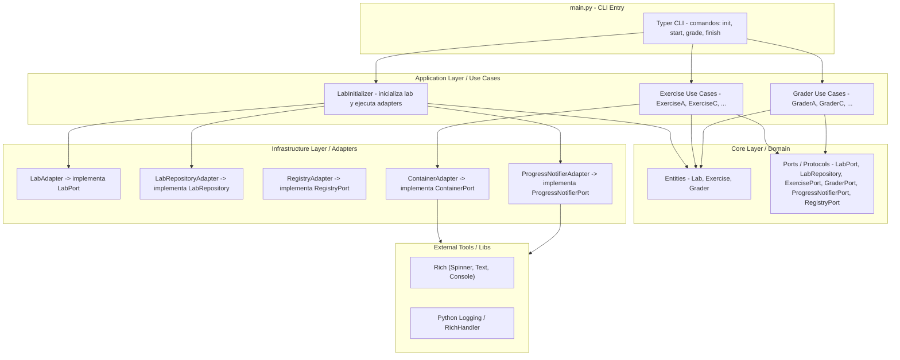

# Lab - CLI framework

CLI de gestión de laboratorio para el curso Ansible101. Permite a los estudiantes inicializar su entorno, arrancar ejercicios, evaluarlos y limpiarlos con un único binario Python.

**Licencia:** GPLv3 · **Python:** `>=3.10`

🌐 **Español** | [English](README.en.md)

---

## Índice

1. [Arquitectura](#arquitectura)
2. [Estructura de ficheros](#estructura-de-ficheros)
3. [Entidad Lab y estado persistido](#entidad-lab-y-estado-persistido)
4. [Comandos CLI](#comandos-cli)
5. [Flujo de `lab init` en detalle](#flujo-de-lab-init-en-detalle)
6. [Registro dinámico de ejercicios y graders](#registro-dinámico-de-ejercicios-y-graders)
7. [Añadir un nuevo ejercicio](#añadir-un-nuevo-ejercicio)
8. [Internacionalización (i18n)](#internacionalización-i18n)
9. [Notificador de progreso (spinners)](#notificador-de-progreso-spinners)
10. [Dependencias de runtime](#dependencias-de-runtime)
11. [Desarrollo local](#desarrollo-local)
12. [Distribución (wheel)](#distribución-wheel)

---

## Arquitectura

El proyecto sigue **Arquitectura Hexagonal (Ports & Adapters)**, dividida en cuatro capas que nunca se saltan:

```
┌─────────────────────────────────────────────────┐
│  main.py  (CLI Entry — Typer)                   │  ← Capa de entrada
└────────────────────┬────────────────────────────┘
                     │ invoca
┌────────────────────▼────────────────────────────┐
│  Application Layer  (Use Cases)                 │  ← Orquestación
│  LabInitializer, Exercise*, Grader*             │
└──────┬──────────────────────────┬───────────────┘
       │ usa Ports (interfaces)   │ usa Ports
┌──────▼──────────┐   ┌──────────▼───────────────┐
│  Core / Domain  │   │  Infrastructure / Adapters│  ← Implementaciones concretas
│  Entities, DTOs │   │  LabAdapter, ContainerAd. │
│  Interfaces     │   │  RegistryAdapter, i18n... │
└─────────────────┘   └──────────────────────────┘
```

### Regla clave
> **Las capas superiores solo dependen de interfaces (puertos), nunca de implementaciones concretas.** Las implementaciones se inyectan desde `main.py` o desde el Use Case correspondiente.



---

## Estructura de ficheros

```
cliapp/
├── pyproject.toml              # Metadatos del paquete y build-system
├── build_requirements.txt      # Solo: build  (para python -m build)
├── README.md                   # Este fichero
├── LICENSE
└── lab/
    ├── main.py                      # Punto de entrada Typer
    ├── application/
    │   └── use_cases/
    │       ├── lab_initializer.py       # Orquesta `lab init`
    │       ├── exercise/
    │       │   ├── __init__.py          # Registro EXERCISES = {nombre: Clase}
    │       │   ├── exercise_vars.py
    │       │   ├── exercise_role.py
    │       │   ├── exercise_webservers.py
    │       │   ├── exercise_databases.py
    │       │   ├── exercise_final.py
    │       │   └── template.py          # Plantilla para nuevos ejercicios
    │       └── grader/
    │           ├── __init__.py          # Registro GRADERS = {nombre: Clase}
    │           ├── grader_vars.py
    │           ├── grader_role.py
    │           ├── grader_webservers.py
    │           └── grader_databases.py
    ├── core/
    │   ├── entities/
    │   │   └── lab.py                   # Entidad Lab (estado global)
    │   ├── dtos/
    │   │   └── EventInfo.py             # DTO para spinner / resultado de evento
    │   └── interfaces/                  # Ports (ABCs / Protocols)
    │       ├── lab_port.py
    │       ├── lab_repository.py
    │       ├── container_port.py
    │       ├── exercise_port.py
    │       ├── grader_port.py
    │       ├── progress_notifier_port.py
    │       └── registry_port.py
    └── infrastructure/
        ├── adapters/
        │   ├── lab_adapter.py              # verify_context + init (builds images)
        │   ├── lab_repository_adapter.py   # load/save .lab_config.json
        │   ├── container_adapter.py        # wrapper podman SDK
        │   └── registry_adapter.py         # auto-discovery de exercises, graders e imágenes
        ├── containerfiles/
        │   └── podman-ssh-ol8.Containerfile   # Imagen base del lab (OL8 + SSH)
        └── ui/
            ├── i18n.py                        # Diccionarios es/en + get_text()
            ├── progress_notifier_adapter.py   # Spinners con Rich
            └── console_utils.py               # Helpers de consola
```

---

## Entidad Lab y estado persistido

La entidad `Lab` (`lab/core/entities/lab.py`) representa el estado global del laboratorio. Tiene dos campos con validación via `@property`:

| Campo | Valores válidos | Default |
|---|---|---|
| `engine` | `"podman"` | `"podman"` |
| `language` | `"es"`, `"en"` | `"es"` |

El estado se persiste en **`.lab_config.json`** en el directorio de trabajo del estudiante, mediante `LabRepositoryAdapter`:

```json
{"engine": "podman", "language": "en"}
```

> `save()` usa introspección de `@property` para serializar automáticamente todos los campos de `Lab`. Si se añade un nuevo campo como `@property`, se persistirá sin tocar el adapter.

---

## Comandos CLI

```
lab [OPTIONS] COMMAND [ARGS]...

Commands:
  init      Inicializa el laboratorio (build de imágenes + deploy clave SSH)
  start     Arranca dependencias del ejercicio indicado (contenedores, config...)
  grade     Evalúa el ejercicio indicado contra criterios definidos
  finish    Libera dependencias del ejercicio (elimina contenedores, etc.)

Options:
  --version / -version
  -h, --help
```

Los comandos `start`, `grade` y `finish` aceptan `--debug / -d` para activar logging en nivel `DEBUG`.

### Autocompletado dinámico

`start` y `grade` tienen autocompletado vía `RegistryAdapter`:

```python
def exercises_autocomplete(ctx, args, incomplete):
    registry = RegistryAdapter()
    return [name for name in registry.auto_discover_exercises() if name.startswith(incomplete)]
```

---

## Flujo de `lab init` en detalle

```
usuario: lab init [podman] [--debug]
              │
              ▼
         main.py::init()
              │  prompt idioma (es/en)
              │  Lab(engine=engine, language=language)
              ▼
         LabInitializer.execute(LabAdapter, LabRepositoryAdapter, Lab)
              │
              ├─ 1. repo_adapter.save(lab)
              │       → escribe .lab_config.json  ← PRIMERO, siempre
              │
              ├─ 2. service.verify_context()
              │       → shutil.which("ansible")   ← Ansible debe estar en PATH
              │       ✗ → sys.exit(1) con mensaje de error
              │
              ├─ 3. service.init(ContainerAdapter, LAB_IMAGES)
              │       → RegistryAdapter.auto_discover_images()  (lee Containerfiles embebidos)
              │       → ContainerAdapter.init_client()          (conecta con el daemon Podman)
              │       → ContainerAdapter.build_image(image)     (por cada Containerfile)
              │       ✗ → sys.exit(1) con mensaje de error
              │
              └─ 4. self._deploy_priv_key()
                      → escribe ~/.ssh/id_lab (clave privada, chmod 600)
                      → permite que Ansible acceda a los contenedores sin password
```

> **¿Por qué `save()` va antes de `verify_context()`?**
> Para garantizar que el idioma elegido se persiste aunque falle la verificación de Ansible (p.ej. en un entorno de dev sin Ansible instalado). Si el orden fuera al revés, el usuario tendría que volver a elegir idioma en el siguiente intento.

---

## Registro dinámico de ejercicios y graders

El sistema usa un **diccionario de registro** definido en los `__init__.py` de cada subpaquete. No hay configuración externa — es puro Python:

```python
# exercise/__init__.py
EXERCISES = {
    "vars":       ExerciseVars,
    "role":       ExerciseRole,
    "webservers": ExerciseWebServers,
    "databases":  ExerciseDatabases,
    "final":      ExerciseFinal,
}
```

`RegistryAdapter` lo expone sin más lógica:

```python
def auto_discover_exercises(self):
    return EXERCISES   # dict {nombre: Clase}
```

`main.py` resuelve el nombre del ejercicio pasado por el usuario, instancia la clase y llama al método:

```python
cls = exercises_map.get(exercisename.lower())
exercise = cls(exercisename)
exercise.start(notifier)     # o .grade() / .finish()
```

Los `Containerfile` se descubren con `importlib.resources`, garantizando que funcionan tanto con `pip install -e .` como instalados desde el `.whl`.

---

## Añadir un nuevo ejercicio

1. **Crear** `lab/application/use_cases/exercise/exercise_nuevo.py` basándote en `template.py`:
   - Clase con métodos `start(notifier)` y `finish(notifier)`.
   - Cada paso: `EventInfo` → `notifier.start()` → operación → `notifier.finish()`.
   - Todos los textos vía `get_text(LANG, 'clave')`.

2. **Registrar** en `exercise/__init__.py`:
   ```python
   from .exercise_nuevo import ExerciseNuevo
   EXERCISES = { ..., "nuevo": ExerciseNuevo }
   ```

3. **Crear grader** `grader/grader_nuevo.py` con método `grade(notifier)` y registrarlo en `grader/__init__.py`.

4. **Añadir textos** en `lab/infrastructure/ui/i18n.py` para los bloques `"es"` y `"en"`.

> No hay que tocar `main.py` ni `RegistryAdapter`. El nuevo ejercicio aparecerá automáticamente en `lab start`, `lab grade` y `lab finish`.

---

## Internacionalización (i18n)

Módulo: `lab/infrastructure/ui/i18n.py`

El idioma activo se lee de `.lab_config.json` en el directorio de trabajo. Si no existe el fichero, el default es `"es"`.

### Uso típico en cada módulo

```python
from lab.infrastructure.ui.i18n import get_text, get_current_language
LANG = get_current_language()   # se evalúa una vez al importar el módulo

# En el código:
error_output = get_text(LANG, 'error_ssh_config', e=e)
event_info   = EventInfo(name=get_text(LANG, 'creando_container_web1'))
```

### Fallback en cadena

```python
text = lang_dict.get(key,           # 1. idioma pedido
       TEXTS["es"].get(key,          # 2. fallback español
       key))                         # 3. fallback: la propia clave como texto
```

### Añadir una clave nueva

```python
# i18n.py → TEXTS
TEXTS = {
    "es": { "mi_clave": "Mensaje en español con {variable}" },
    "en": { "mi_clave": "Message in English with {variable}" },
}

# Uso:
get_text(LANG, 'mi_clave', variable="valor")
```

---

## Notificador de progreso (spinners)

Módulo: `lab/infrastructure/ui/progress_notifier_adapter.py` → implementa `ProgressNotifierPort`.

Usa **Rich** para mostrar un spinner animado mientras se ejecuta cada paso. El patrón es idéntico en todos los use cases:

```python
event_info = EventInfo(name=get_text(LANG, 'mi_paso'))
spinner_handle, finished_event = notifier.start(event_info)

failed, error_output = self._mi_operacion()     # la operación real (bloqueante)

event_info.failed    = failed
event_info.error_msg = error_output
notifier.finish(spinner_handle, finished_event)
sys.exit(1) if event_info.failed else None
```

`EventInfo` es un DTO mutable. El spinner lo lee al terminar para mostrar ✅ o ❌ según `event_info.failed`.

---

## Dependencias de runtime

Declaradas en `pyproject.toml` → `[project] dependencies`:

| Librería | Versión | Uso |
|---|---|---|
| `typer` | `0.17.4` | Framework CLI |
| `typing_extensions` | `4.15.0` | Anotaciones de tipo compatibles |
| `rich` | `14.1.0` | Spinners, colores, logging |
| `podman` | `5.6.0` | SDK Python para el daemon Podman |
| `paramiko` | `4.0.0` | SSH desde los graders hacia los contenedores |
| `PyYAML` | `6.0.3` | Lectura de playbooks en los graders |

> **Ansible no es dependencia pip.** El CLI invoca el ejecutable `ansible` del sistema vía `subprocess`. Sin Ansible en PATH, `lab init` fallará en el paso 2 pero `.lab_config.json` **sí** se habrá escrito.

---

## Desarrollo local

```shell
python -m venv venv
source venv/bin/activate
cd cliapp/
pip install -e .        # instala en modo editable con todas las dependencias

lab --help
lab init
lab start vars
lab grade vars
lab finish vars
```

Con `-e` (editable), cualquier cambio en el código fuente es inmediato sin reinstalar.

---

## Distribución (wheel)

```shell
cd cliapp/
pip install -r build_requirements.txt   # instala el módulo 'build'
python -m build
```

Genera `dist/lab-X.Y.Z-py3-none-any.whl`. Los estudiantes instalan directamente desde GitHub Releases:

```shell
pip install https://github.com/rafmarsan/Ansible101/releases/download/vX.Y.Z/lab-X.Y.Z-py3-none-any.whl
```

El sufijo `py3-none-any` indica wheel puro Python, compatible con cualquier OS y arquitectura.

---

### Referencias

- [Typer](https://typer.tiangolo.com/)
- [Rich](https://rich.readthedocs.io/)
- [Podman Python SDK](https://podman-py.readthedocs.io/)
- [Packaging Projects](https://packaging.python.org/en/latest/tutorials/packaging-projects/)
- [click-completion](https://github.com/click-contrib/click-completion)
